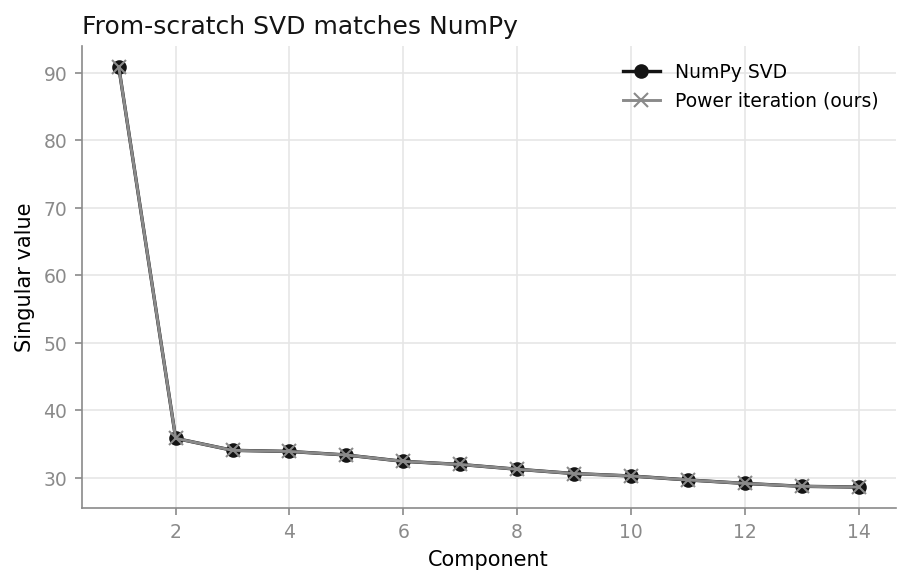
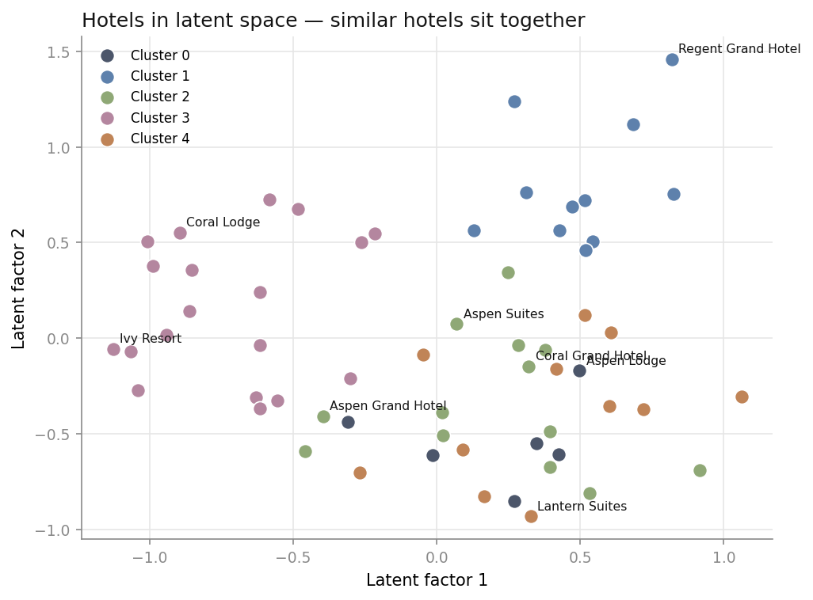
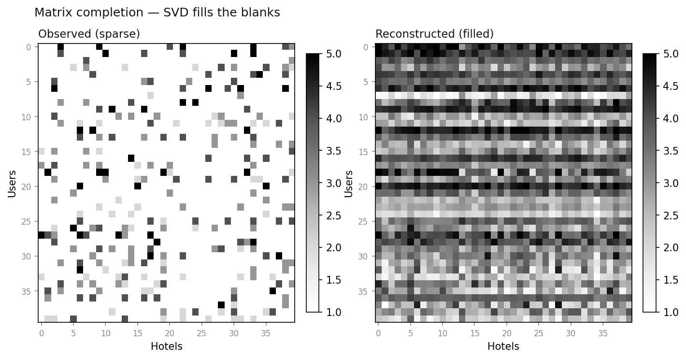

# 🏨 Hotel Recommender — SVD from first principles

Matrix factorization for hotel recommendations, with the SVD **written by hand**
(power iteration + deflation) instead of called from a library — then measured
honestly against FunkSVD and item-based collaborative filtering.

**▶ [Live demo](https://johnkang0720.github.io/Hotel-Recommendation/)** — interactive, runs entirely in your browser (no backend).
The full Streamlit app also ships in the repo (`streamlit run app.py`).

---

## The point

I wanted to actually *understand* SVD, not import it. So the core lives in
[`hotelsvd/svd.py`](hotelsvd/svd.py): find the top singular vector by running
power iteration on the Gram matrix, peel off that rank-1 piece, repeat. It
reproduces `numpy.linalg.svd` to **~1e-14**.

Then I used it for what SVD is good at — filling in a sparse user × hotel
ratings matrix so you can recommend hotels a traveller hasn't seen.

## The bug I fixed

My first version filled every missing rating with `0` and fed that straight into
the decomposition. Two problems: the recommendations were biased toward zero, and
the latent-space plot came out as **two meaningless straight lines** (a
hyper-sparse, zero-filled matrix collapses onto its axes).

The fix is **FunkSVD** — learn the factors by gradient descent over the ratings
that *actually exist*, and never touch the blanks. Same idea (latent factors),
correct treatment of missing data. It wins across the board:

| Model | RMSE ↓ | Recall@10 ↑ | NDCG@10 ↑ |
|---|---|---|---|
| **FunkSVD (observed-only)** | **0.715** | **0.304** | **0.168** |
| SVD (mean-imputed) | 1.091 | 0.192 | 0.106 |
| Item-based CF | 0.781 | 0.205 | 0.094 |

## What it looks like

**The from-scratch SVD lands exactly on NumPy's** — that's the correctness check:



**Hotels in latent space** — the fixed version of the plot that used to be two lines:



**Matrix completion** — sparse ratings in, full reconstruction out:



More figures (`scree`, `learning_curve`, `reconstruction_error`) live in
[`figures/`](figures/) and in the app.

## Run it

```bash
pip install -r requirements.txt
python scripts/generate_dataset.py      # writes data/hotel_ratings.csv
python scripts/run_experiments.py       # prints the table, saves all figures
streamlit run app.py                     # interactive demo
pytest -q                                # 8 tests: SVD correctness, FunkSVD recovery, metrics
```

## The data

The demo ships with a small, **seeded** dataset built from a known 4-factor
structure (Luxury / Location / Value / Family) — which is what lets me *prove*
the SVD recovers real structure rather than eyeball it. My original pipeline ran
on the external TripAdvisor dump; [`scripts/prepare_tripadvisor.py`](scripts/prepare_tripadvisor.py)
reproduces it exactly if you drop those CSVs into `dataset/`.

## Layout

```
hotelsvd/
  svd.py         # power-iteration SVD + deflation (the from-scratch core)
  funk.py        # FunkSVD — SGD over observed ratings only
  baselines.py   # item-based CF + K-Means clustering
  evaluate.py    # RMSE, Recall@K, NDCG@K
  data.py        # ratings → matrix + masked train/test split
  viz.py         # every figure
scripts/         # generate data · run experiments · real-data adapter
tests/           # correctness + recovery + metric checks
app.py           # Streamlit demo
```
